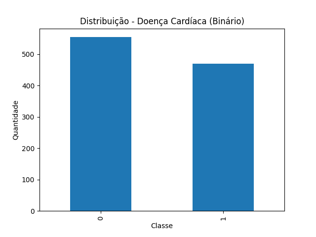
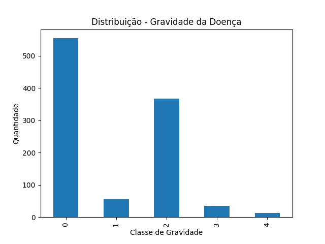
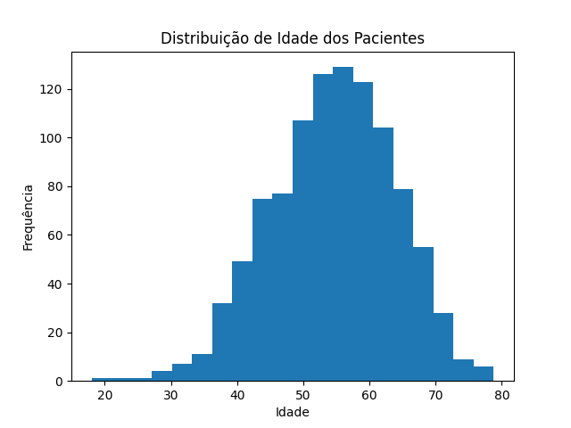

# FIAP - Faculdade de Informática e Administração Paulista

<p align="center">
<a href= "https://www.fiap.com.br/"></a>
</p>

<br>

# Projeto: Exploração e Implementação de Dados de Saúde 

## CardioIA Vision Lab

## 👨‍🎓 Integrantes: 
- <a href="https://www.linkedin.com/in/jonastadeufernandes">Jonas Tadeu V. Fernandes - RM563027</a>
- <a href="https://www.linkedin.com/">Levi Passos Silveira Marques - RM56557</a>
- <a href="https://www.linkedin.com/in/raphaelsilva-phael">Raphael da Silva - RM561452<</a> 
- <a href="https://www.linkedin.com/in/raphael-dinelli-8a01b278">Raphael Dinelli Neto - RM562892</a> 
- <a href="https://www.linkedin.com/in/yan-cotta">Yan Pimental Cotta - RM562836</a>

## 👩‍🏫 Professores:
### Tutor(a) 
- <a href="https://www.linkedin.com/company/inova-fusca">Nome do Tutor</a>
### Coordenador(a)
- <a href="https://www.linkedin.com/in/andregodoichiovato">André Godoi</a>


## 📜 Descrição

### 1. Visão Geral do Conjunto de Dados
O dataset utilizado contém 1.024 registros e 14 variáveis clínicas relacionadas a fatores de risco, exames e indicadores de doença cardíaca. As variáveis incluem atributos demográficos (idade e sexo), medidas fisiológicas (pressão arterial em repouso, colesterol sérico, frequência cardíaca máxima), além de variáveis categóricas associadas a exames e sintomas clínicos.

A análise inicial foi realizada com o objetivo de verificar a integridade, consistência e adequação dos dados para uso futuro em modelos de Inteligência Artificial aplicados à saúde cardiovascular.

#### Observação: o script utilizado para a análise do dataset está disponível em: 
[Script de análise exploratória](./src/analisys.py)

### 2. Verificação de Qualidade e Integridade dos Dados
Foram conduzidas as seguintes verificações:

Identificação de valores nulos (NaN);

Busca por possíveis valores ausentes mascarados (ex.: "?");

Avaliação de valores mínimos para detectar possíveis inconsistências clínicas (como pressão arterial ou colesterol iguais a zero).

Os resultados indicaram:

Ausência de valores nulos explícitos;

Ausência de valores inválidos representados por caracteres especiais;

Valores mínimos clinicamente plausíveis nas variáveis contínuas (idade mínima de 18 anos, colesterol mínimo de 100 mg/dL e pressão arterial mínima dentro de limites fisiológicos possíveis).

Dessa forma, conclui-se que o dataset apresenta boa qualidade estrutural para uso analítico, não sendo necessária, nesta fase, imputação ou tratamento adicional de dados ausentes.

### 3. Definição e Análise das Variáveis Alvo
O conjunto de dados apresenta duas variáveis relacionadas ao diagnóstico:

target_binary: indica presença (1) ou ausência (0) de doença cardíaca;

num: representa o grau de severidade da doença, variando de 0 a 4.

Observou-se que:

554 registros (54,1%) correspondem a pacientes sem doença cardíaca;

470 registros (45,9%) correspondem a pacientes com diagnóstico positivo.

Essa distribuição demonstra um bom balanceamento para classificação binária, reduzindo o risco de viés estatístico em modelos supervisionados que venham a ser treinados posteriormente.

Entretanto, ao analisar a variável de severidade (num), verificou-se desbalanceamento entre as classes de gravidade. A classe 2 concentra a maior parte dos casos positivos, enquanto as classes 3 e 4 possuem representatividade significativamente menor. Esse comportamento pode influenciar o desempenho de modelos multiclasses, favorecendo a predição da classe majoritária.

### 4. Análise Visual
Foram gerados gráficos de distribuição para:

### Figura 1 – Distribuição da Doença Cardíaca (Binária)



A Figura 1 demonstra o equilíbrio entre pacientes saudáveis e diagnosticados com doença cardíaca.

---

### Figura 2 – Distribuição da Gravidade da Doença



Observa-se desbalanceamento entre as classes de severidade.

---

### Figura 3 – Distribuição Etária dos Pacientes



A maior concentração de pacientes encontra-se em faixas etárias adultas e idosas.

A visualização reforça o equilíbrio da variável binária e evidencia o desbalanceamento das subclasses de gravidade. A distribuição de idade demonstra predominância de pacientes em faixas etárias adultas e idosas, perfil esperado em estudos cardiovasculares.

### 5. Considerações para Aplicação em IA
A análise exploratória confirma que o dataset é adequado para aplicações de:

Classificação binária (detecção de doença cardíaca);

Classificação multiclasses (predição de severidade);

Estudos comparativos de fatores de risco.

Contudo, para modelos multiclasses, poderá ser necessária a aplicação de técnicas de balanceamento (como oversampling, undersampling ou ponderação de classes) a fim de mitigar possíveis vieses decorrentes da distribuição desigual das classes de gravidade.


## 📁 Estrutura de pastas

Dentre os arquivos e pastas presentes na raiz do projeto, definem-se:

- <b>.github</b>: Nesta pasta ficarão os arquivos de configuração específicos do GitHub que ajudam a gerenciar e automatizar processos no repositório.

- <b>assets</b>: aqui estão os arquivos relacionados a elementos não-estruturados deste repositório, como imagens.

- <b>config</b>: Posicione aqui arquivos de configuração que são usados para definir parâmetros e ajustes do projeto.

- <b>document</b>: aqui estão todos os documentos do projeto que as atividades poderão pedir. Na subpasta "other", adicione documentos complementares e menos importantes.

- <b>scripts</b>: Posicione aqui scripts auxiliares para tarefas específicas do seu projeto. Exemplo: deploy, migrações de banco de dados, backups.

- <b>src</b>: Todo o código fonte criado para o desenvolvimento do projeto ao longo das 7 fases.

- <b>README.md</b>: arquivo que serve como guia e explicação geral sobre o projeto (o mesmo que você está lendo agora).

## 🔧 Como executar o código

Toda a análise exploratória do dataset pode ser executada navegando até o diretório src e executando o comando.
```bash
python analysis.py
```


## 🗃 Histórico de lançamentos

* 0.1.0 - XX/XX/2026
    *

## 📋 Licença

<p xmlns:cc="http://creativecommons.org/ns#" xmlns:dct="http://purl.org/dc/terms/"><a property="dct:title" rel="cc:attributionURL" href="https://github.com/agodoi/template">MODELO GIT FIAP</a> por <a rel="cc:attributionURL dct:creator" property="cc:attributionName" href="https://fiap.com.br">Fiap</a> está licenciado sobre <a href="http://creativecommons.org/licenses/by/4.0/?ref=chooser-v1" target="_blank" rel="license noopener noreferrer" style="display:inline-block;">Attribution 4.0 International</a>.</p>


